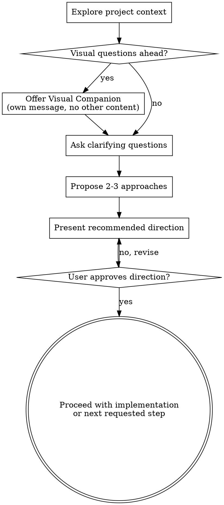

# Brainstorming Ideas Into Directions

Help turn ideas into clear, shared directions through natural collaborative dialogue.

Start by understanding the current project context, then ask focused questions one at a time to refine the idea. Once you understand what should happen, present the recommended direction and get user approval before implementation.

<HARD-GATE>
Do NOT invoke implementation skills, write code, or change behavior until you have presented the direction and the user has approved it.
</HARD-GATE>

## Anti-Pattern: "This Is Too Simple To Think Through"

Even simple work benefits from a short design pass.

The brainstorming can be very short — sometimes just a few bullets and one clarifying question — but you should still make sure you and the user agree on the direction before implementation.

## Checklist

1. **Explore project context** — check files, docs, recent commits when relevant
2. **Offer visual companion** (if upcoming questions will be visual) — this must be its own message. See the Visual Companion section below.
3. **Ask clarifying questions** — one at a time, understand purpose, constraints, and success criteria
4. **Propose 2-3 approaches** — with trade-offs and your recommendation
5. **Present the direction** — scale it to the task, from a few bullets to a short structured design
6. **Get approval** — once approved, proceed with the next requested step

## Process Flow

## The Process

**Understanding the idea:**

- Check the current project state first when context matters
- Before asking detailed questions, assess scope
- If the request is too large or mixes unrelated subsystems, help break it into smaller pieces before going deeper
- For normal-sized work, ask one question at a time to refine the idea
- Prefer multiple-choice questions when possible, but open-ended is fine
- Focus on understanding: purpose, constraints, success criteria

**Exploring approaches:**

- Propose 2-3 different approaches with trade-offs
- Present options conversationally with your recommendation and reasoning
- Lead with your recommended option and explain why

**Presenting the direction:**

- Once you believe you understand what you're building, present the direction
- Scale each section to the task: a few sentences or bullets if straightforward, more structure if nuanced
- Cover the parts that matter: architecture, components, data flow, error handling, testing, UX, or migration concerns as needed
- Ask whether it looks right before moving on to implementation

**Design for isolation and clarity:**

- Break the system into smaller units with one clear purpose
- Prefer well-defined interfaces and focused files
- If you cannot explain what a unit does, how it is used, and what it depends on, the boundaries likely need work
- Smaller, well-bounded units are easier to reason about and safer to change

**Working in existing codebases:**

- Explore the current structure before proposing changes
- Follow existing patterns where reasonable
- Include targeted improvements when the current structure directly harms the requested work
- Do not propose unrelated refactoring

## Scope Control

Keep this skill proportional.

By default:
- No mandatory design doc
- No mandatory implementation plan
- No automatic handoff into other skills
- No forced process beyond gaining clarity and approval

If the user explicitly asks for a written spec, plan, or more formal process, you can do that. Otherwise, stop once the direction is approved and continue with the user's requested work.

## Key Principles

- **One question at a time** — don't overwhelm the user
- **Multiple choice preferred** — easier to answer when appropriate
- **YAGNI ruthlessly** — remove unnecessary features from designs
- **Explore alternatives** — don't lock onto the first idea without checking trade-offs
- **Incremental validation** — present direction, get approval, then proceed
- **Be flexible** — go back and clarify when something doesn't make sense

## Visual Companion

A browser-based companion for showing mockups, diagrams, and visual options during brainstorming. Available as a tool — not a mode. Accepting the companion means it's available for questions that benefit from visual treatment; it does NOT mean every question goes through the browser.

**Offering the companion:** When you anticipate that upcoming questions will involve visual content (mockups, layouts, diagrams), offer it once for consent:
> "Some of what we're working on might be easier to explain if I can show it to you in a web browser. I can put together mockups, diagrams, comparisons, and other visuals as we go. This feature is still new and can be token-intensive. Want to try it? (Requires opening a local URL)"

**This offer MUST be its own message.** Do not combine it with clarifying questions, context summaries, or any other content. The message should contain ONLY the offer above and nothing else. Wait for the user's response before continuing. If they decline, proceed with text-only brainstorming.

**Per-question decision:** Even after the user accepts, decide for each question whether to use the browser or the terminal. The test: **would the user understand this better by seeing it than reading it?**

- **Use the browser** for visual content — mockups, wireframes, layout comparisons, architecture diagrams, side-by-side visual designs
- **Use the terminal** for text content — requirements questions, conceptual choices, trade-off lists, scope decisions

A question about a UI topic is not automatically a visual question. "What kind of wizard do you want?" is conceptual — use the terminal. "Which of these wizard layouts feels right?" is visual — use the browser.

If they agree to the companion, read the detailed guide before proceeding:
`visual-companion.md`
